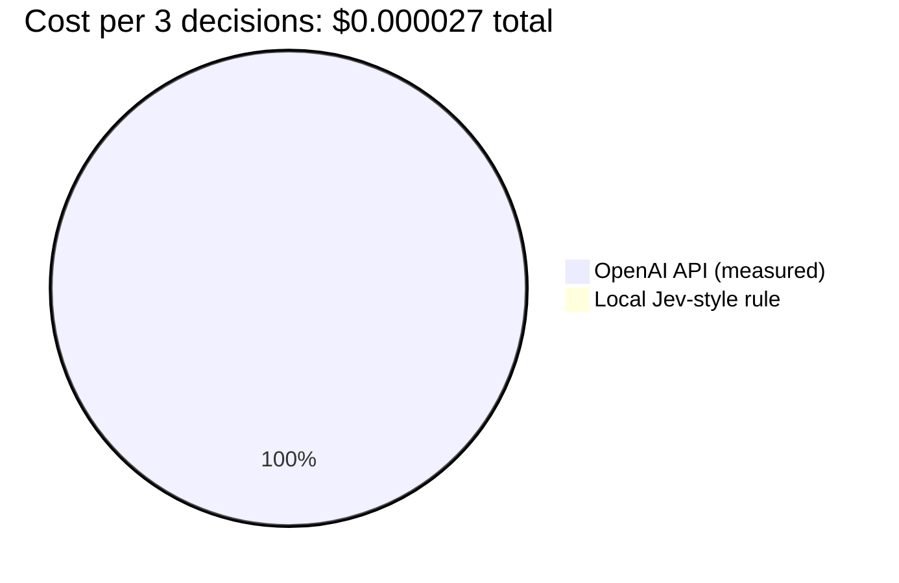
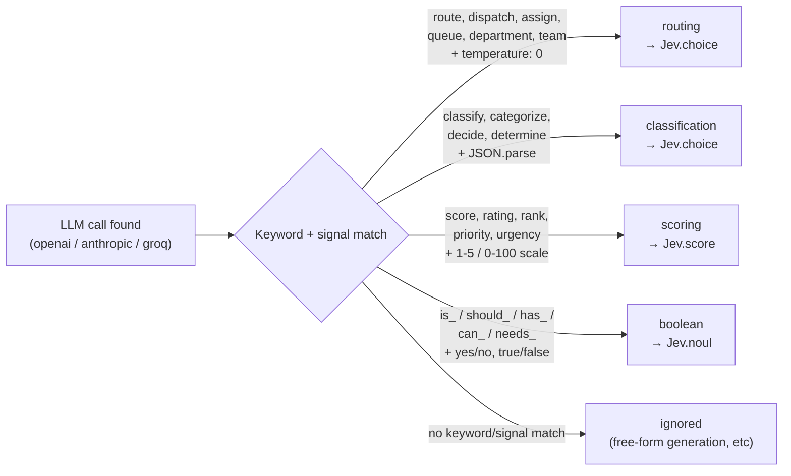
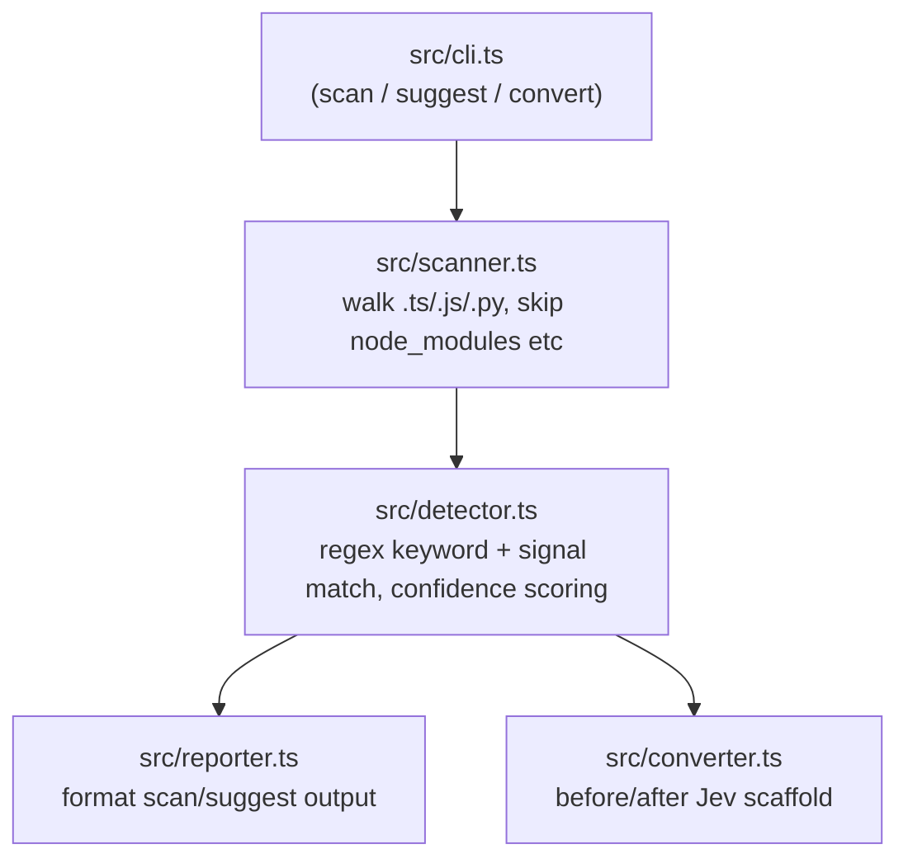

# jev-migrate

[](https://www.npmjs.com/package/jev-migrate)
[](https://github.com/akanthed/jev-migrate/blob/main/LICENSE)
[](https://github.com/akanthed/jev-migrate)

Find the LLM calls in your codebase that are secretly just routing, classification, scoring, or yes/no decisions — and see what converting them to TypeSafe Jev would save you.

```bash
npx jev-migrate scan ./your-project
```

An LLM call like this:

```ts
const response = await openai.chat.completions.create({
  model: "gpt-4o-mini",
  temperature: 0,
  max_tokens: 20,
  messages: [{ role: "system", content: "Route this ticket to: billing, technical, sales" }],
});
```

...is a network round-trip, a token bill, and 500-2000ms of latency spent on a decision with a handful of possible outputs. `jev-migrate` scans your repo, finds calls shaped like this, scores how confident it is, and shows you the conversion.

## Why this matters (measured, not guessed)

Most tools like this just assert "99% cheaper, 100x faster" as marketing copy. We measured it instead — [`test/benchmark.ts`](test/benchmark.ts) fires the exact prompts from our test fixtures at the real OpenAI API (`gpt-4o-mini`, `temperature: 0`) and times a rules-based local equivalent doing the same job.

**Real run, 2026-09-21, 3 cases:**

| Case | Type | LLM latency | Local latency | Speedup | LLM cost | Local cost |
|---|---|---:|---:|---:|---:|---:|
| ticket-routing | routing | 2641ms | 0.212ms | **12,483x** | $0.000008 | $0 |
| content-moderation | classification | 750ms | 0.605ms | **1,240x** | $0.000011 | $0 |
| fraud-detection | boolean | 837ms | 0.425ms | **1,968x** | $0.000009 | $0 |
| **Total** | | **4228ms** | **1.242ms** | **3,405x** | **$0.000027** | **$0** |

```mermaid
xychart-beta
    title "Latency per decision: LLM call vs local rule (log scale, ms)"
    x-axis ["ticket-routing", "content-moderation", "fraud-detection"]
    y-axis "Latency (ms, log10)" 0 --> 4
    bar [3.42, 2.88, 2.92]
    bar [-0.67, -0.22, -0.37]
```


*(top bar = OpenAI call, bottom bar = local rule — plotted as log10(ms) since the gap is 1,000x+ and a linear chart would flatten the local bar to invisible)*



All three local rules landed on the **same answer** the LLM gave — same routing decision, same classification, same fraud flag. That's the actual claim: for narrow decisions with a fixed set of outputs, an LLM round-trip is frequently pure overhead.

Run it yourself:

```bash
OPENAI_API_KEY=sk-... npx ts-node test/benchmark.ts
```

> Numbers will vary run to run (network, OpenAI load) but the order of magnitude won't. The local side is a hand-written rule per case, not the real Jev SDK — it's a stand-in to prove the *shape* of the savings, not a guarantee that your specific decision generalizes as cleanly.

## What it detects



| Pattern | Trigger keywords | Confidence-boosting signal | Converts to |
|---|---|---|---|
| **Routing** | route, dispatch, assign, queue, department, team | `temperature: 0` + `max_tokens < 100` | `Jev.choice` |
| **Classification** | classify, categorize, decide, determine | `temperature: 0` + `JSON.parse` / `json.loads` | `Jev.choice` |
| **Scoring** | score, rating, rank, priority, urgency | 1-5 or 0-100 scale mentioned | `Jev.score` |
| **Boolean** | `is_`, `should_`, `has_`, `can_`, `needs_` | yes/no or true/false phrasing | `Jev.noul` |

Works across **TypeScript, JavaScript, and Python** — including old-style `openai.ChatCompletion.create(...)` and Python kwargs (`temperature=0` as well as `temperature: 0`).

## Confidence scoring

Confidence isn't a guess either — it's additive, capped per category, based on how many real signals back up the keyword match:

```mermaid
xychart-beta
    title "Confidence build-up by category"
    x-axis ["boolean", "scoring", "classification", "routing"]
    y-axis "Confidence" 0 --> 1
    bar [0.70, 0.65, 0.70, 0.60]
    bar [0.15, 0.20, 0.20, 0.30]
```


*(bottom = base confidence from keyword match alone, top = added confidence once the supporting signal — scale, JSON parsing, temperature+token cap — also matches)*

Only detections **above 60%** show up in the "high-confidence" section of a scan.

## Try it

```bash
npm install
npm run build
node dist/cli.js scan ./your-project
```

Real output, scanning this repo's own test fixtures:

```
📊 jev-migrate scan results

  Files scanned: 7
  Files with potential conversions: 6
  Total detections: 10

💰 Estimated savings if converted:
  Cost reduction: 99%
  Latency improvement: 50-200x faster
  High-confidence conversions: 10

🎯 High-confidence detections (> 60% confidence):

  1. content-moderation.ts:6
     Type: classification → Jev.choice
     Confidence: 90%
     Code: const response = await anthropic.messages.create({

  2. mixed-patterns.ts:8
     Type: routing → Jev.choice
     Confidence: 90%
     Code: const response = await openai.chat.completions.create({

  ... (top 10 shown)
```

### Commands

| Command | What it does |
|---|---|
| `jev-migrate scan [dir]` | Full report: files scanned, detections, estimated savings, top 10 high-confidence hits |
| `jev-migrate suggest [dir]` | Same as `scan` — alias |
| `jev-migrate convert [dir]` | Shows a before/after **scaffold** for each detection (`Jev.choice` / `Jev.score` / `Jev.noul`) |

`convert` prints a scaffold, it does not rewrite your files. Filling in the real option list / scale / input from your original prompt is the part that needs a human — that's also the part that determines whether the migration is actually safe for your use case.

## Architecture



## Honest limitations

- Detection is regex/keyword-based, not an AST parse — it can miss unusually-worded prompts and, rarely, false-positive on a comment that happens to contain a trigger word.
- `convert` gives a scaffold, not a verified rewrite. You still need to port the real option list, scale, and prompt logic.
- The benchmark's "local rule" is hand-written per test case to prove the latency/cost shape — it is not the actual Jev SDK, since accuracy on *your* decision boundary depends entirely on how well you encode the same logic the LLM was implicitly doing.
- Only OpenAI, Anthropic, and Groq call shapes are matched today.

## Test suite

```bash
npm test
```

7 fixtures, covering all 4 patterns across TS and Python, plus a false-positive fixture that must produce **zero** detections. All currently pass.

## License

MIT
